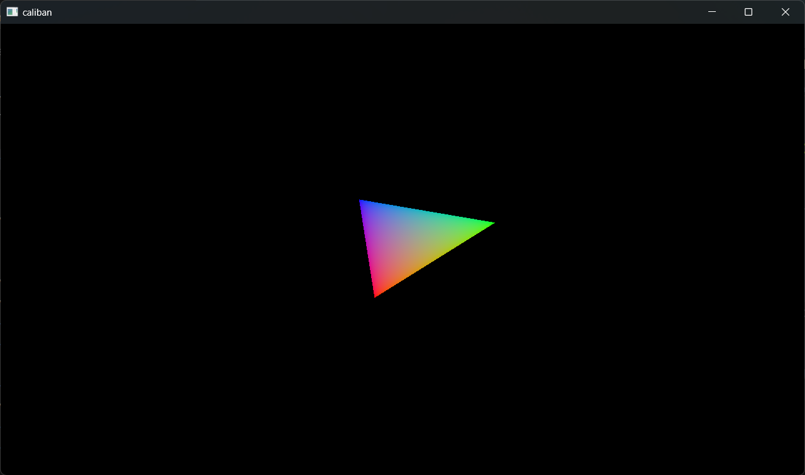

The one and only Vulkan triangle, written in Rust.

Implementation of the Vulkan tutorial from
https://kylemayes.github.io/vulkanalia/introduction.html, to
teach myself Vulkan (and some Rust too). In time, I hope to
expand this to some sort of engine-playground for experimenting
with graphics programming. For now, there is:

- A Vulkan instance provided by the `vulkanalia` crate
- Error checking with validation layers
- Physical and logical devices selection
- A window surface and swapchain, with image views and
  framebuffers as needed
- A render pass and pipeline
- Shader modules
- Vertex buffers, index buffers, staging buffers, uniform
  buffers, buffers everywhere
- The Vulkan Triangle
- Samplers and textures
- A depth buffer
- OBJ model loading
- Mipmaps
- Multisample antialiasing (MSAA)
- Push constants
- Primary and secondary command buffers

The code is being heavily commented as I go through the tutorial, so it can be useful as an implementation reference.